# Taipei Mass Rapid Transit(MRT) Hourly Traffic Database

## Step 1: Scope the Project and Gather Data
### Scope

Taipei Mass Rapid Transit (MRT) branded as Taipei Metro, is a rapid transit system serving the areas of Taipei and New Taipei in Taiwan, operated by the government owned Taipei Rapid Transit Corporation.

Taipei Metro was the first metro system ever built in Taiwan. The initial network was approved for construction in 1986. Since 2008, the network has expanded to 131.

This project uses Taipei Metro hourly traffic data along with Metro station data and Metro station exit data to build a database for Metro traffic analysis.

<p align="center">
  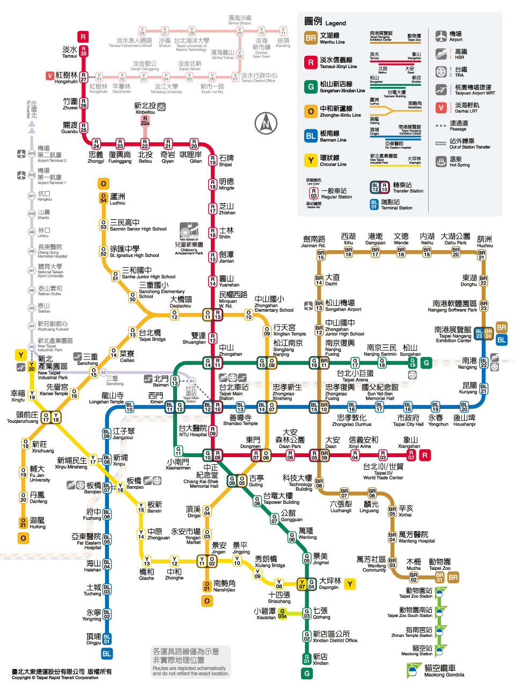
</p>


### Describe and Gather Data

The project includes 3 datasets from 2 sources:
  - Taipei Metro hourly traffic data released by [Taipei Rapid Transit Corporation](https://data.gov.tw/dataset/128506) on monthly basis. Columns include date, hour, entrance_station, exit_station and traffic sequentially.
  <p align="center">
    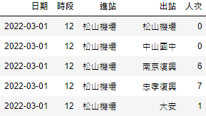
  </p>
  
  - Metro station data from [Public Transport Data Exchange](https://ptx.transportdata.tw/MOTC/). Columns include StationID, StationAddress, BikeAllowOnHoliday, LocationCity, LocationCityCode, StationName_Zh_tw, StationName_En, StationPosition_PositionLon, StationPosition_PositionLat, StationPosition_GeoHash, VersionID. <br>
  <p align="center">
    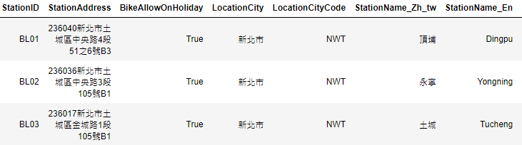
    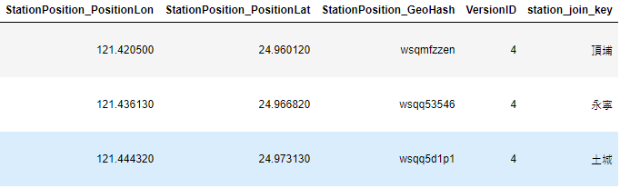
  </p>
  
  - Metro station exist data from [Public Transport Data Exchange](https://ptx.transportdata.tw/MOTC/). Columns include StationID, ExitID, Stair, Escalator, Elevator, StationName_Zh_tw, StationName_En, ExitName_Zh_tw, ExitName_En, ExitPosition_PositionLon, ExitPosition_PositionLat, ExitPosition_GeoHash, VersionID.
  <p align="center">  
    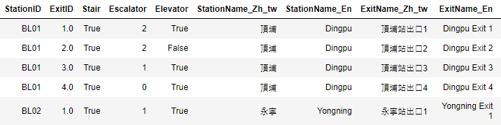
    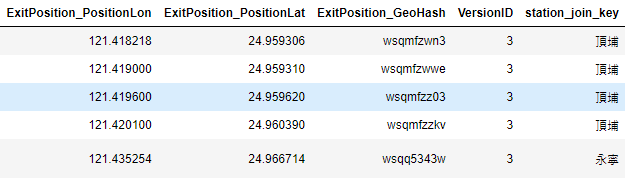
  </p>
  
## Step 2: Explore and Assess the Data
### Explore the Data

  - According to [Taipei Metro](https://english.metro.taipei/cp.aspx?n=E6F97A6FF9935E98), there are 131 stations, where some transfer stations are calculated as one while others calculated as two:
    > Transfer stations (Ximen, CKS Memorial Hall, Guting and Dongmen Stations) that connect two lines yet share only one physical station, are calculated as one station each. Other stations connecting two lines are calculated as two stations.
  - Currently there are 6 lines in service (2022/5), including Wenhu Line, Tamsui-Xinyi Line, Songshan-Xindian Line, Zhonghe-Xinlu Line, Bannan Line and Circular Line.
  - In __Taipei Metro hourly traffic data__, entrance and exit station are in its Chinese name, there are 119 distint station values where all transfer stations are counted as one.
  - In __Metro station data__, there are station name in both Chiness and English, and station id, where station id the primary key of the dataset.
  - Station id is consist of the abbreviation of its line color and a two digit serial number, ex: BL01, G05. 
  - A transfer station has two station id. For example, Tapei Main Station is a transfer station of red line and blue line. BL12 and R10 are its station id.
  - As a reulst, all transfer stations are counted as 2 in __Metro station data__, so there are in total 135 stations in the dataset. 
### Cleaning Steps

 - As mensioned above, __Taipei Metro hourly traffic data__ use station name, in order to join it with __Metro station data__, station name will be the join key.
 - There are 3 station names that is inconsistent between the 2 data set, namely Banqiao(BL08), Banqiao(Y16) and Daqiaotou (O12).

    | station name | station id | line | name in hourly traffic dataset | name in station dataset
    |---|---|---|---|---|
    | Banqiao | BL08 | Blue | BL板橋 (BL-Banqiao) | 板橋 (Banqiao) |
    | Banqiao | Y06 | Yellow | Y板橋 (Y-Banqiao) | 板橋 (Banqiao) |
    | Daqiaotou | O12 | Orange | 大橋頭站 (Daqiaotou Station) | 大橋頭(Daqiaotou) |

<p align="center">
  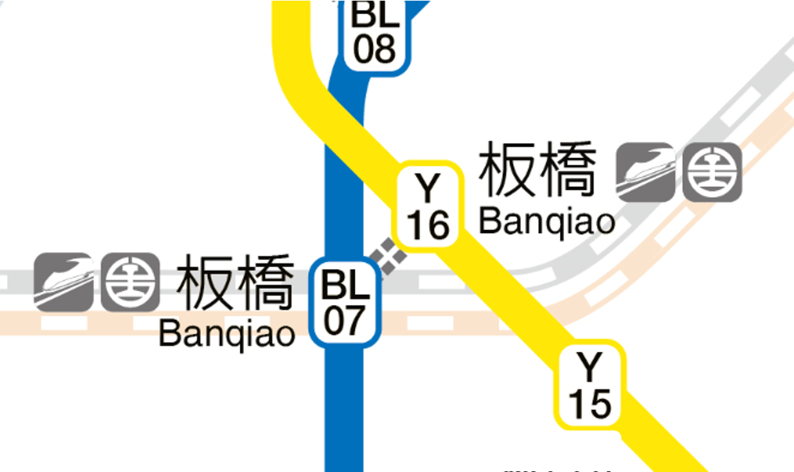
  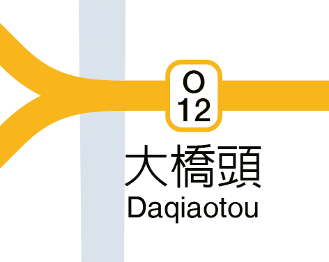
</p>

- In order to join the two dataset, adding a new column named _station_join_key_ which aligns station name based on __Taipei Metro hourly traffic data__.

## Step 3: Define the Data Model
### 3.1 Conceptual Data Model
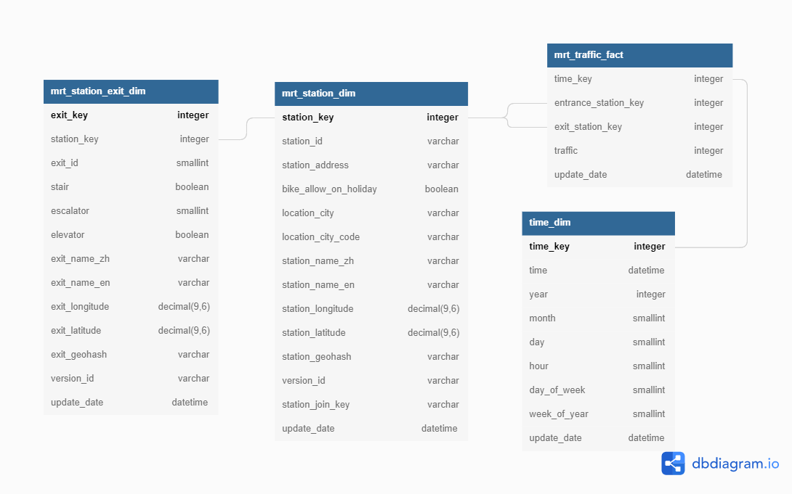

### 3.2 Process and Data Pipelines
  - Set up credentials in __credentials.cfg__
  - Get source data by running __source_functional.py__ 
  - Setup Redshift cluster by running __redshift_cluster_create.py__ in command line:
    ```
    redshift_cluster_create.py -c true -d false
    ```
  - Create tables with in Redshift with code from __mrt_create_tables.sql__
  - Run data pipelines by airlfow:
    - Set up conections including _aws_credentials_ and _redshift_
    - Run dag:
      - Load station data and station exit data from S3 bucket into stagin table in redshift.
      - Transform station data and station exit data into format of dimension table.
      - Schedule the process of updating traffic data from S3 into staging table in Redshift on monthly basis.
      - Generate time dimension table from staging traffic table
      - Generate traffic fact table
      - Check if stations in traffic fact table is align with staging station table and station dimension table. 

  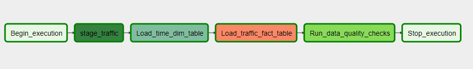

### Step 4: Data dictionary
  - mrt_station_dim
    - station_key           : primary key of the table
    - station_id            : primary key of data source
    - station_address       : station address
    - bike_allow_on_holidy  : 0=not allow,  1=allow
    - version_id            : version of source data
    - station_join_key      : join key for traffic data

  - mrt_station_exit_dim
    - exit_key        : primary key of the table
    - station_key     : foreign key of mrt_station_dim
    - exit_id         : primary key of data source
    - stair           : 0=without stair, 1=with stair
    - escalator       : 0=None, 1=both direction, 2=exit only, 3=entrance only
    - elevator        : 0=without elevator, 1=with elevator
    - version_id      : version of source data


## Step 5: Complete Project Write Up
- __Clearly state the rationale for the choice of tools and technologies for the project.__
  - Redshift is designed for OLAP and BI application.
  - MRT traffic data is a historical dataset updated on monthly basis, which is suitable for OLAP database.
  - Redshift is following pay-as-you-go that the system can scale up or down easily when needed, which provide flexibilty compared to traditional on-premised database.
  - User management can be achieved easily by AWS IAM, saving time and engery for IT department
- __Propose how often the data should be updated and why.__
  - MRT traffic data is a historical dataset released on the website on monthly basis, so it is suggested that the data should be update monthly.
- __Write a description of how you would approach the problem differently under the following scenarios:__
  - __The data was increased by 100x.__
    - For dataset that is 100x larger, extra number of nodes will be needed as well as upgrading node to more powerful types.
  - __The data populates a dashboard that must be updated on a daily basis by 7am every day.__
    - Scheduling it in airflow dag.
  - __The database needed to be accessed by 100+ people.__
    - This can be managed by AWS IAM.
- __Example of DB output__:
  - Get the exit traffic of every station for for those entering Songshan Airport on 12:00, January 2nd, 2022: 
    ```
    SELECT C.time
          , D.station_name_en AS entrance_station
          , B.station_name_en AS exit_station
          , B.station_id AS exit_id
          , A.traffic
    FROM mrt_traffic_fact A
    LEFT JOIN mrt_station_dim B ON A.exit_station_key = B.station_key
    LEFT JOIN mrt_station_dim D ON A.entrance_station_key = D.station_key
    LEFT JOIN time_dim C ON A.time_key = C.time_key
    WHERE D.station_name_en = 'Songshan Airport'
    AND C.time = '2022-01-02 12:00'
    ```
    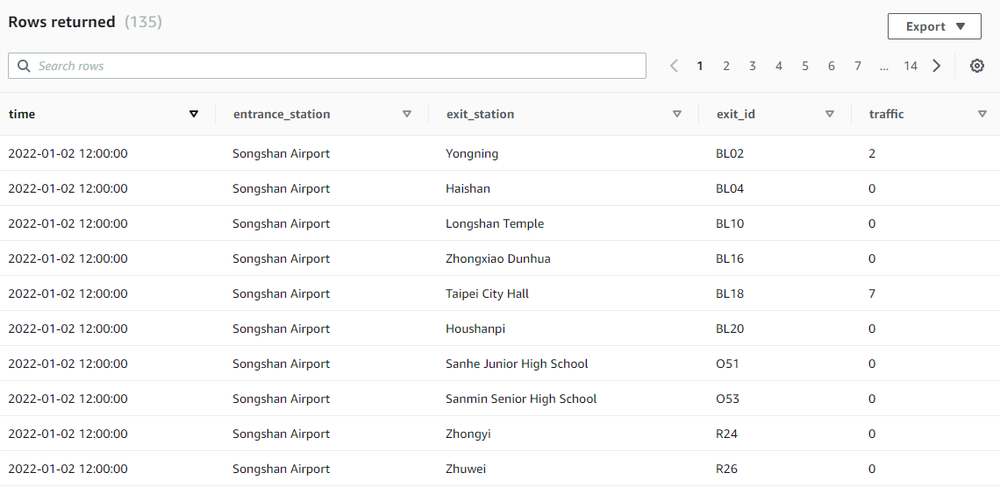
  - Get total data points by each day:
    ```
    SELECT TRUNC(X.time) AS Date 
          , COUNT(*)
    FROM
    (
      SELECT C.time
            , D.station_name_en AS entrance_station
            , B.station_name_en AS exit_station
            , B.station_id AS exit_id
            , A.traffic
      FROM mrt_traffic_fact A
      LEFT JOIN mrt_station_dim B ON A.exit_station_key = B.station_key
      LEFT JOIN mrt_station_dim D ON A.entrance_station_key = D.station_key
      LEFT JOIN time_dim C ON A.time_key = C.time_key
    ) X
    GROUP BY TRUNC(X.time)
    ORDER BY TRUNC(X.time)
    ```
    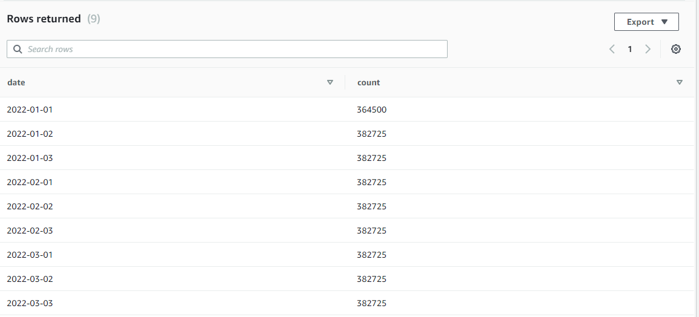
